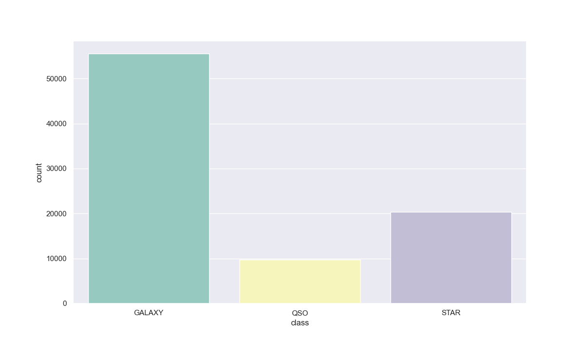

# Laporan Proyek 1 Machine Learning Terapan
---
# Identifikasi Bintang, Galaksi dan Quasar Menggunakan _Machine Learning_
Nama : Irma Indriana Hariawang   
Email : irma_loh@yahoo.com   
ID Dicoding : irma_h

## 1. Domain Proyek
### 1.1. Latar Belakang
Pengamatan langit telah menjadi kegiatan yang menarik bagi manusia sejak zaman kuno. Namun, dengan kemajuan teknologi, kita sekarang memiliki alat yang jauh lebih canggih untuk memahami alam semesta. Salah satu alat yang semakin penting adalah _machine learning_, yang telah mengubah cara kita menganalisis dan mengidentifikasi objek langit seperti bintang, galaksi, dan quasar.

_Machine learning_ adalah cabang dari kecerdasan buatan yang memungkinkan komputer untuk belajar dari data tanpa harus secara eksplisit diprogram. Dengan jumlah data astronomi yang besar dan kompleksitasnya yang terus meningkat, _machine learning_ menjadi alat yang sangat berguna dalam mengidentifikasi objek langit.

Identifikasi bintang adalah salah satu tugas penting dalam astronomi. Bintang memiliki ciri-ciri yang khas dalam data pengamatan mereka, seperti spektrum cahaya yang berbeda-beda, magnitudo, dan warna. _Machine learning_ dapat digunakan untuk mengklasifikasikan bintang berdasarkan fitur-fitur ini. Misalnya, algoritma klasifikasi seperti _Support Vector Machines (SVM)_ atau _Artificial Neural Network (ANN)_ dapat dilatih dengan data bintang yang diketahui untuk mengenali pola-pola khas yang mengidentifikasi jenis-jenis bintang.

Sementara itu, identifikasi galaksi juga merupakan tantangan dalam astronomi modern. Galaksi memiliki beragam bentuk, ukuran, dan struktur. _Machine learning_ memungkinkan kita untuk mengklasifikasikan galaksi-galaksi ini berdasarkan ciri-ciri morfologi mereka. Penggunaan _Convolutional Neural Networks (CNN)_, yang awalnya dikembangkan untuk pengenalan gambar, telah terbukti sangat efektif dalam mengidentifikasi dan mengklasifikasikan galaksi berdasarkan pola-pola visual dalam citra astronomi.

Kemudian, quasar, yang merupakan inti galaksi aktif dengan energi yang sangat besar, juga menjadi fokus penelitian astronomi. Identifikasi quasar dalam data pengamatan langit memerlukan pendekatan yang cermat. _Machine learning_ dapat digunakan untuk memisahkan quasar dari benda langit lainnya, seperti bintang atau galaksi biasa, berdasarkan ciri-ciri spektrum cahaya yang khas. Algoritma seperti _Random Forests_ atau _Deep Learning_ dapat digunakan untuk tugas ini dengan tingkat akurasi yang tinggi.

Penerapan _machine learning_ dalam astronomi tidak hanya membantu kita mengidentifikasi objek langit secara lebih efisien, tetapi juga memungkinkan penemuan objek-objek baru dan pemahaman yang lebih baik tentang alam semesta. Namun, tantangan yang dihadapi adalah ketersediaan data yang berkualitas tinggi dan perluasan teknik _machine learning_ yang ada untuk menangani kompleksitas yang terus meningkat dari data pengamatan yang diperoleh dari observatorium-observatorium di seluruh dunia.

Dalam kesimpulan, penggunaan _machine learning_ dalam identifikasi bintang, galaksi, dan quasar telah membawa revolusi dalam astronomi modern. Dengan memanfaatkan kekuatan komputasi dan algoritma-algoritma cerdas ini, kita dapat menggali lebih dalam rahasia alam semesta dan memahami lebih baik tempat kita di dalamnya.

---

## 2. _Problem Understanding_
### 2.1. _Problem Statements_ dan _Goals_
Berdasarkan kondisi yang telah diuraikan sebelumnya, kita akan mengembangkan sebuah sistem identifikasi untuk menjawab permasalahan berikut ini:
- Dari serangkaian fitur fotometri yang didapatkan dari pengamatan, fitur-fitur apa saja yang dapat digunakan sebagai identifikasi antara bintang, galaksi dan quasar?
- Dapatkah dibedakan secara cepat dan tepat apakah benda langit hasil pengamatan merupakan sebuah bintang, galaksi atau quasar?

Untuk menjawab pertanyaan tersebut, kita akan menggunakan Multiclass Classification dengan tujuan atau goals sebagai berikut :
- Mengetahui fitur-fitur yang paling membedakan antara bintang, galaksi dan quasar
- Membuat model _machine learning_ yang dapat dengan cepat dan tepat mengklasifikasikan benda langit berdasarkan fitur-fitur fotometri yang didapatkan dari pengamatan.

### 2.2. Metodologi
Klasifikasi bintang, galaksi dan quasar adalah tujuan yang ingin dicapai. Metode klasfikasi yang akan digunakan adalah multi kategorikal klasifikasi dengan lebih dari 2 fitur data. Oleh karena itu, metodologi pada proyek ini adalah : membangun model klasifikasi 3 kelas sebagai targetnya. 

### 2.3. Metrik
Metrik digunakan untuk mengevaluasi sebarapa baik model dalam mengklasifikasikan data pengamatan. Untuk kasus _multiclass classification_ beberapa metrik yang biasanya digunakan adalah _Accuracy, Precesion, Recall_ dan _F1-score_. Dalam proyek ini akan digunakan metrik _Accuracy_.

---

## 3. _Data Understanding_
### 3.1. _Data Loading_
_Dataset_ yang digunakan merupakan data pengamtan yang terdiri dari 100.000 baris dan 18 kolom yang didapatkan dari SDSS. SDSS (_Sloan Digital Sky Survey_) adalah pengamatan dalam berbagai panjang gelombang dan survei spektroskopi _redshift_ (pergeseran merah) menggunakan teleskop optik diameter 2,5 meter di Apache Point Observatorium, New Mexico, Amerika Serikat. Proyek ini dimulai pada tahun 2000 dan namanya diambil dari nama Alfred P. Sloan Foundation, sebuah organisasi yg menyumbangkan dana pada proyek ini secara signifikan.

Link download : https://www.kaggle.com/datasets/fedesoriano/stellar-classification-dataset-sdss17?resource=download

### 3.2. Exploratory Data Analysis - Deskripsi Variabel
Berdasarkan informasi dari Kaggle, variabel-variabel pada data SDSS adalah sebagai berikut :   

obj_ID = _Object Identifier_ (identitas objek)    
alpha = _Right Ascension_ (sudut asensiorekta pada epoch J2000)   
delta = _Declination_ (sudut deklinasi pada epoch J2000)  
u = _Ultraviolet filter_ pada sistem fotometri    
g = _Green filter_ pada sistem fotometri  
r = _Red filter_ pada sistem fotometri    
i = _Near Infrared filter_ pada sistem fotometri  
z = _Infrared filter_ pada sistem fotometri   
run_ID = _Run Number used_ (identitas spesifik scan   
rereun_ID = _Rerun Number_ (identitas image processed)    
cam_col = _Camera column_     
field_ID = _Field number_     
spec_obj_ID = _Unique ID_ untuk pengamatan spektroskopi   
class = _object class (galaxy, star or quasar object)_    
_redshift_ = _redshift_ (pergeseran merah)  
plate = _plate ID_    
MJD = _Modified Julian Date_  
fiber_ID = _fiber ID_

### 3.3. _Exploratory Data Analysis - Missing Values_, Duplikasi dan _Outliers_
Menentukan _missing values_, duplikasi dan _outliers penting untuk dilakukan supaya tidak terjadi bias ketika data dipelajari oleh model. Dari hasil pengolahan data didapatkan informasi berikut ini :
1. Jumlah missing values adalah 0, tidak ada baris kosong didalam tabel
2. Jumlah duplikasi adalah 0, tidak ada data yang sama di dalam tabel
3. Terdapat _outliers_ pada kolom 'i' dan '_redshift_'. Jumlah total _outliers_ yang di temukan sebanyak 14.266 baris. Karena jumlahnya yang tidak signifikan terhadap total jumlah data yaitu 100.000 maka _outliers_ ini dihapus.

### 3.4. _Exploratory Data Analysis - Univariate Analysis_
Data dalam tabel terbagi menjadi 2 bagian, yaitu : _numerical features dan categorical features_. Yang termasuk dalam _numerical features_ adalah : _obj_ID, alpha, delta, u, g, r, i, z, run_ID, rerun_ID, cam_col, field_ID, spec_obj_ID, _redshift_, plate, MJD dan fiber_ID_.
Yang termasuk _categorical features_ adalah : _class_.

#### 3.4.1 _Numerical Features_
Dari _numerical features_ yang ada, akan dibagi lagi menjadi 3 bagian yaitu : data identitas obyek langit, data posisi obyek langit dan data intrinsik obyek langit. 
- Data identitas : _obj_ID, run_ID, rerun_ID, cam_col, field_ID, spec_obj_ID dan fiber_ID_. 
- Data posisi : _alpha, delta, plate dan MJD_. 
- Data intrinsik : u, g, r, i, z dan _redshift_.  
  
Terdapat 5 grafik yang ditampilkan dalam _Univariate Analysis_ :
1. Grafik alpha, delta terhadap _class_
   
      Dari grafik alpha diatas diketahui bahwa obyek pengamatan paling banyak berada di arah timur sampai selatan pengamat, dengan derajat alpha sebesar 120 sampai 260 derajat.
   
       Dari grafik delta diatas diketahui bahwa obyek pengamatan paling banyak berada di langit bagian utara dengan derajat delta dari -20 derajat sampai 70 derajat.

2. Grafik alpha, delta benda langit yang diplot terhadap koordinat langit.
   
      Dari gambar koordinat langit, terlihat bahwa obyek pengamatan terdapat di langit bagian utara, yang berarti pengamat juga berada di bumi bagian utara.
3. Grafik _Color Magnitude Diagram_
   
   Dari grafik CMD diketahui bahwa obyek pengamatan didominasi dengan benda langit yang berada di deret utama dengan skala 0 sampai 6. Bintang-bintang ini masih tergolong usia muda.
4. Grafik _redshift distribution_
   
      Grafik _redshift_ diatas memberi penjelasan bahwa obyek langit yang diamati bergerak positif (mengalami _redshift_/pergeseran merah) yang artinya obyek pengamatan bergerak menjauhi pengamat.
5. Grafik Spektroskopi
   
   Grafik spektroskopi diatas memberi informasi bahwa obyek langit yang memancarkan energi terbesar adalah Quasar. Walaupun secara jumlah cukup sedikit, tetapi pancaran energinya sangat besar.

#### 3.4.2 _Categorical Features_
Hanya terdapat 1 kolom yang termasuk dalam categorical features, yaitu kolom _"class"_. Kolom class terdiri dari star, galaxy dan quasar. Didapatkan hasil jumlah presentasi Galaksi 64.8 % Stars 23.8 % dan Quasars 11.4.

### 3.5. _Exploratory Data Analysis - Multivariate Analysis_
_Multivariate_ analisis ditampilkan dalam bentuk _matrix correlation_ untuk fitur numerik. Terdapat korelasi yang kuat untuk data intrinsik benda langit, yaitu : u, g, r, i, z dan _redshift_.

---
## 4. _Data Preparation_
Terdapat 4 tahapan yang dilakukan dalam _data preparation_, yaitu : _encoding_ fitur kategori, mengatasi _imbalance data_, pembagian data _train-test-split_ dan standarisasi data.

### 4.1. _Encoding Fitur Kategori_
Untuk _encoding fitur class_ digunakan metode _"Label Encoder"_. Metode ini dipilih karena terdapat lebih dari 2 kategori klasifikasi. Didapatkan hasilnya : 
|||
|---|---:|
|0|Galaxy|
|1|Quasars|
|2|Star|
|||

### 4.2. _Imbalance Data_
Jumlah _dataset_ berdasarkan _class_ adalah :
Galaxy : 55.585
Star : 20.408
Quasars : 9.741
Terdapat ketidakseimbangan jumlah data di tiap _class_. Dilakukan teknik _resample_, supaya jumlah _dataset_ menjadi seimbang. Hasil _resample_ :
Galaxy : 55.585
Quasars : 55.585
Star : 55.585

### 4.3. _Train-Test-Split_
Dataset dibagi menjadi 80:20 untuk train dan test. Hasil dari pembagian _dataset_ menjadi :
Total sample _dataset_ : 166.755
Train _dataset_ : 133.404
Test _dataset_ : 33.351

### 4.4. Standarisasi
Standardisasi adalah teknik transformasi yang paling umum digunakan dalam tahap persiapan data untuk pemodelan. Untuk fitur numerik, tidak akan dilakukan transformasi dengan _label encoder_ seperti pada fitur kategori melainkan digunakan teknik _StandarScaler_ dari _library Scikitlearn_. Setelah proses standarisasi maka selanjutnya data siap untuk pemodelan.

---

## 5. _Model Development_
Dalam proyek ini dipilih 3 algoritma untuk menghasilkan model yang sesuai dengan problem statements dan goal yaitu solusi untuk _multiclass classification_.

### 5.1. _K-Nearest Neighbors_
_K-Nearest Neighbors_ (KNN) adalah algoritma yang digunakan untuk masalah klasifikasi dan regresi. Algoritma ini bekerja berdasarkan prinsip "kemiripan". Dalam konteks klasifikasi, objek baru akan diklasifikasikan berdasarkan mayoritas kelas dari k-tetangga terdekatnya. KNN bisa digunakan untuk klasifikasi multi-kelas. Dalam hal ini, kelas objek baru akan ditentukan berdasarkan mayoritas kelas dari k-tetangga terdekatnya. Untuk meningkatkan performa model KNN, penting untuk menormalisasi fitur, menemukan nilai _n_neighbors_ yang optimal, serta melakukan tuning parameter menggunakan metode seperti _Grid Search cross-validation_.
Dalam proyek yang dikerjakan, didapatkan hasil bahwa algoritma KNN bekerja paling optimal dengan nilai n = 1 menghasilkan nilai _accuracy_ terbaik yaitu 0,974394

### 5.2. Decision Tree
Algoritma Decision Tree bekerja dengan memilih fitur terbaik untuk memecah data dan mengulanginya secara rekursif hingga mencapai kondisi tertentu. Algoritma ini sangat cocok untuk:
1. Klasifikasi data yang memiliki fitur kategorikal atau numerik.
2. Masalah yang memerlukan interpretasi yang mudah dan bisa dijelaskan. 

Dalam proyek ini, digunakan random_state = 30 dan menghasilkan nilai _accuracy_ 0.966207

### 5.3. _Random Forest_
_Random Forest_ bekerja dengan membuat sejumlah _Decision Tree_ dan menggabungkan hasil prediksinya melalui metode voting. Salah satu parameter _tuning_ nya adalah _n_estimators_ yaitu Jumlah _Decision Trees_ dalam _Random Forest_.
Dalam proyek ini dilakukan pencarian nilai _n_estimators_ terbaik yang memberikan nilai _accuracy_ terbesar. Hasilnya _n_estimators_ = 20 dengan _accuracy_ 0,979670.
||Estimators|_Accuracy_|
|---|---|---:|
|0|1.0|0,959791|
|1|2.0|0,961680|
|2|3.0|0,971845|
|3|4.0|0,973134|
|4|5.0|0,975353|
|5|6.0|0,974873|
|6|7.0|0,977032|
|7|8.0|0,976972|
|8|9.0|0,977842|
|9|10.0|0,977902|
|10|11.0|0,978082|
|11|12.0|0,978501|
|12|13.0|0,979221|
|13|14.0|0,978891|
|14|15.0|0,979041|
|15|16.0|0,979311|
|16|17.0|0,979461|
|17|18.0|0,979371|
|18|19.0|0,979671|
|19|20.0|0,979701|

---

## 6. _Evaluation_
Metrik yang digunakan dalam evaluation adalah metrk _accuracy_. _Accuracy_ adalah metrik yang paling sederhana dan intuitif. _accuracy_ menggambarkan seberapa sering model membuat prediksi yang benar. 

$$ Accuracy = {(JumlahPrediksiBenar)\over (Jumlah Prediksi Benar + Jumlah Prediksi Salah)}$$   
Dari perhitungan diperoleh hasil bahwa algortima Random Forest memberikan nilai _accuracy_ tertinggi yaitu 0,979671. Selanjutnya K-Nearest Neighbors dengan accuray 0,974394. Yang terendah algoritma Decision Tree dengan _accuracy_ 0,966208.
|No|Model|Accuracy|
|---|---|---:|
|1|Random Forest|0,979671|
|2|KNN|0,974394 |
|3|Decision Tree|0,966208|

Dari hasil perhitungan diatas didapatkan hasil berikut :    

    1. Fitur-fitur intrinsik benda langit dapat digunakan sebagai identifikasi apakah benda langit tersebut merupakan bintang, galaksi atau quasar. 
   
    2. Model yang dikembangkan dengan algoritma Random Forest mampu untuk menjawab permasalahan yang dirumuskan, yaitu identifikasi bintang, galaksi dan quasar dengan akurasi model sebesar 97,96%.

---

## 7. Referensi

Judul : [_Identifying galaxies, quasars, and stars with machine learning: A new catalogue of classifications for 111 million SDSS sources without spectra_](https://www.aanda.org/articles/aa/full_html/2020/07/aa36770-19/aa36770-19.html#FN2)
Penulis : A. O. Clarke, A. M. M. Scaife, R. Greenhalgh and V. Griguta

---

